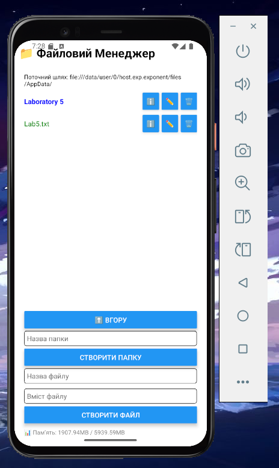
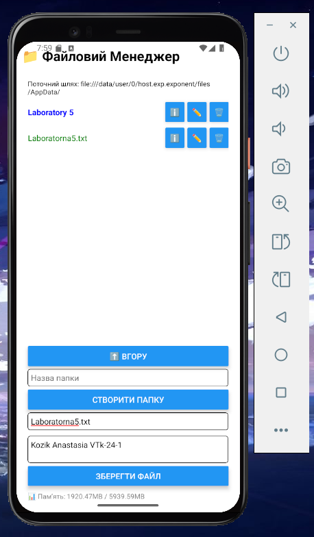
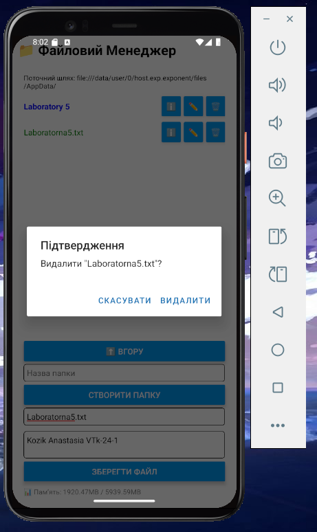
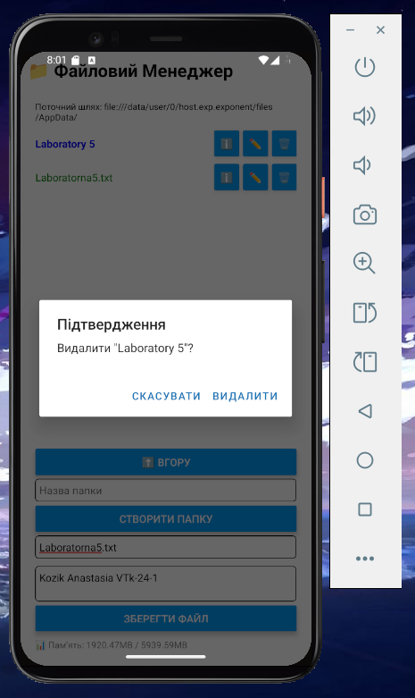
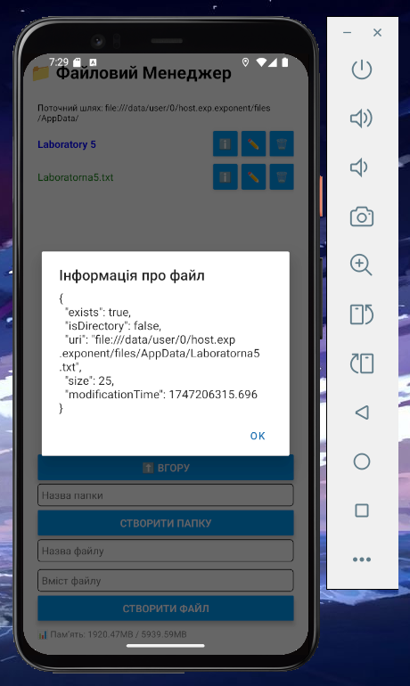
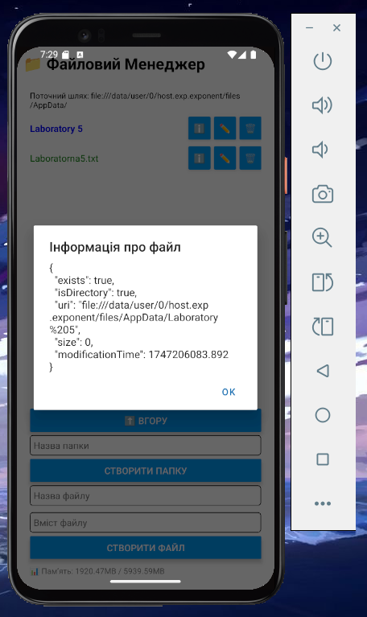
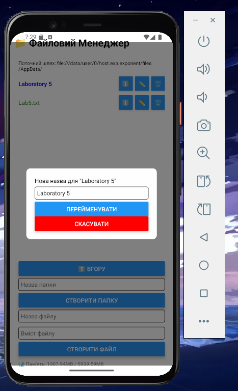
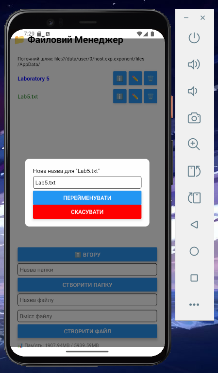

# Лабораторна робота №5

## Тема:
**Робота з файловою системою в React Native з використанням бібліотеки `expo-file-system`.**

## Мета роботи:
Опанувати механізми роботи з локальною файловою системою мобільного пристрою на базі React Native, використовуючи можливості бібліотеки `expo-file-system`. Закріпити навички реалізації базових операцій над файлами й папками, організації файлової навігації та аналізу стану файлової системи.

## Опис роботи:
У межах цієї лабораторної роботи було розроблено простий файловий менеджер для мобільних пристроїв на базі **React Native** з використанням бібліотеки **expo-file-system**.
Додаток дозволяє переглядати, створювати, редагувати та видаляти файли й папки у спеціальній директорії **AppData**.

## Встановлення залежностей:
npm install
npx expo install expo-file-system

---

## Скріншоти роботи застосунку:

### 1. Створення та редагування файлів: 

### 2. Перегляд вмісту файлів: 

### 3. Видалення файлу: 

### 4. Видалення папки: 

### 5. Перегляд детальної інформації про файл:

### 6. Перегляд детальної інформації про папку:

### 7. Редагування назви папки:

### 8. Редагування назви файлу:

## Автор:
**Козік Анастасія Ігорівна**  
Студентка групи **ВТк-24-1**
